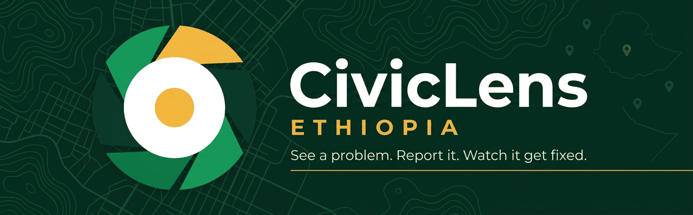

<div align="center">
  
</div>

<h1 align="center">🔍 CivicLens Ethiopia — Civic Intelligence Platform</h1>

> **See a problem. Report it. Watch it get fixed.** Citizens report city problems with video evidence, local AI triages them, humans decide, organizations resolve — and everyone can verify.

<div align="center">

[](https://www.python.org/)
[](https://fastapi.tiangolo.com/)
[](https://react.dev/)
[](#-the-ai-that-knows-its-place)
[](#-built-for-ethiopia)
[](#-battle-tested)
[](DEPLOYMENT.md)
[](#-works-where-the-network-doesnt)

</div>

---

## 🌟 What Makes CivicLens Different?

Most reporting apps are a form that emails a bureaucrat. **CivicLens is a full civic operating system** — evidence-grade media pipeline, local AI triage, deterministic routing, SLA enforcement, community verification, and a public transparency portal. And it runs entirely on infrastructure a city can own.

```
🤖 AI RECOMMENDS  →  ⚙️ BACKEND VALIDATES  →  🧑‍⚖️ HUMANS DECIDE  →  📜 EVERYTHING AUDITED
```

That pipeline is a hard architectural rule, not a slogan: the AI can **never** resolve a report, ban a citizen, expose private data, or make any irreversible decision. Every AI output is labelled *"AI-generated advisory. Human decision required."*

---

## 🚀 Core Capabilities

### 🧠 **Local AI Triage Engine**
- Classifies every report: **category → issue type → severity 1–5 → confidence**
- Reads the description **and** watches the evidence (video frames via FFmpeg → vision model)
- Pluggable brains: zero-dependency multilingual heuristic *or* any local [Ollama](https://ollama.com) model (`llava`, `llama3.x`) — same contract, hot-swappable
- Confidence gates: low confidence → human review queue; high severity → human review queue; AI disagrees with the citizen → human review queue
- **Versioned eval harness blocks any model regression in CI** (en/am/om/ti accuracy, severity ordering, adversarial robustness — all at 1.0)

### 🗣️ **Built for Ethiopia**
| | Language | UI | AI Classification | Voice Reporting |
|---|----------|----|----|-----|
| 🇬🇧 | English | ✅ | ✅ | ✅ Whisper |
| 🇪🇹 | አማርኛ (Amharic) | ✅ | ✅ deep keyword engine | ✅ Whisper |
| 🇪🇹 | Afaan Oromoo | ✅ | ✅ + script/token language detection | — |
| 🇪🇹 | ትግርኛ (Tigrinya) | ✅ | ✅ + am↔ti disambiguation | — |

Speak your report in Amharic or English — 🎙️ Whisper transcribes it and AI drafts the report for your review. 8 cities pre-configured, geofenced routing rules, Noto Sans Ethiopic typography.

### 🛰️ **Evidence Integrity Chain**
Every upload gets forensic treatment:
| Layer | Check |
|-------|-------|
| 🧾 SHA-256 | Cryptographic chain — any tampering is detectable |
| 👁️ Perceptual hash | Catches re-uploaded / recycled "evidence" |
| 🎞️ Multi-frame signatures | Catches **re-recorded videos of the same scene** |
| 📍 Geo-plausibility | Coordinates vs. claimed city (40 km radius) |
| 🔬 Deep validation | MIME + magic bytes + ffprobe — corrupt/fake media rejected |

Low integrity score? The report isn't deleted or accused — it *"requires additional verification"* and a human reviews it. Evidence is never authority.

### ⚖️ **Human-in-the-Loop Everything**
- **Review queue** — every low-confidence / high-severity / disputed AI call lands in front of a moderator; corrections train-label the dataset and are **never overwritten by automation**
- **Resolution verification** — physical-issue categories can't be marked "resolved" without photo/video proof; before/after advisory comparison; **citizens confirm or dispute** the fix (dispute → auto-reopen)
- **Community verification** — "is this still a problem?" votes are evidence for humans, never authority
- **Duplicates are clustered, never auto-deleted** — pluggable analyzers: geo+text, image hash, video frame signatures

### 🏛️ **One Platform, Five Task Flows**
| Role | Flow |
|------|------|
| 👤 Citizen | Report → Track → Follow → **Verify the fix** |
| 🏢 Organization | Inbox → Assign → Work → Resolve (with proof) |
| 🧑‍⚖️ Moderator | Review → Decide → Audit |
| 🛡️ Admin | Monitor → Investigate → Govern |
| 📊 Leadership | **Civic Briefing** → Trends → Performance → Action |

The **Civic Briefing** gives leadership a daily AI-drafted digest — emerging hotspots, SLA breaches, trend spikes — every line advisory, every decision human.

### ⏱️ **SLA Engine with Teeth**
Severity-driven clocks (sev-5: acknowledge in 1h, resolve in 24h) with automatic escalation up the chain — assignee → supervisors → admins. Breaches surface in dashboards, the transparency portal, and Prometheus alerts.

### 🌍 **Radical Transparency**
Public portal with resolution rates, per-organization performance scorecards, response times, and full-text search over anonymized reports. Reporter identity is never public; coordinates are fuzzed (~11 m; ~110 m for sensitive categories like schools).

### 📴 **Works Where the Network Doesn't**
- **PWA + service worker** — installable, app-shell loads offline
- **Offline report queue** — write the report in a dead zone; it syncs (media included) when the network returns, without duplicates
- **Resumable chunked uploads** — a 100 MB video on 3G survives interruptions
- **Web Push + SSE + email** — real-time updates on every channel you allow

---

## 🏗️ Architecture

```
  📱 React SPA (Vite · Tailwind · Leaflet maps · Recharts)  ← PWA + offline queue
        │ same-origin /api (cookie session · CSRF · zero secrets in frontend)
        ▼
  ⚙️ FastAPI backend ──► SQLite (dev) / PostgreSQL (prod) · Alembic (8 migrations)
        │ ├─ 📦 storage: local disk / S3-compatible (MinIO tested) — media streamed
        │ │            only through access-controlled endpoints, Range supported
        │ ├─ 🔁 jobs: thread pool (dev) / Redis queue + concurrent workers (prod)
        │ ├─ 🔔 notify: in-app + SSE + Web Push (VAPID) + SMTP  (circuit-broken)
        │ └─ 📈 /api/metrics: zero-dep Prometheus exposition
        ▼ async job
  🎬 FFmpeg pipeline (probe · thumbnail · frame extraction · transcode)
        ▼
  🧠 Local AI service (port 8090, pluggable)
        ├─ heuristic v1.4 — EN/AM/OM/TI classifier, zero dependencies
        ├─ ollama — any local vision/LLM model
        └─ whisper — voice-to-report transcription
        ▼
  🗺️ Routing rules (category + city + keywords + geofence) → recommendation
        → human review → organization portal → resolution → citizen verification
```

**Fails safe at every seam:** AI down → reports queue for manual review. Redis down → in-memory fallback. SMTP down → circuit breaker, in-app delivery continues. Worker crash → jobs recovered. Nothing is ever lost.

---

## ⚡ Quick Start

<details open>
<summary><b>🐳 Docker (production-style, one command)</b></summary>

```bash
cp .env.example .env   # set CL_SECRET_KEY, POSTGRES_PASSWORD, CL_ADMIN_EMAIL/PASSWORD
docker compose up --build -d
# → http://localhost:8000  (first boot: migrations → seed → your admin account)
```
</details>

<details>
<summary><b>🔧 Local dev (3 terminals)</b></summary>

```bash
# 1 — AI service
cd ai-service && pip install -r requirements.txt && python main.py

# 2 — API  (auto-creates SQLite + demo data)
cd backend && pip install -r requirements.txt
python seed.py && python -m uvicorn app.main:app --reload

# 3 — Frontend
cd frontend && npm install && npm run dev
# → http://localhost:5173
```

**Demo accounts** (dev only): `admin@civiclens.et`/`admin12345` · `moderator@civiclens.et`/`moderator123` · `staff@roads.et`/`roads12345` · `citizen@example.et`/`citizen123`
</details>

<details>
<summary><b>📈 Monitoring stack (Grafana + Prometheus, pre-provisioned)</b></summary>

```bash
docker compose -f docker-compose.yml -f docker-compose.monitoring.yml up -d
# Grafana → http://localhost:3001  (9-panel dashboard + 7 alert rules included)
```
</details>

---

## 🚢 Deploy Anywhere

One repo, seven ready-made targets — see **[DEPLOYMENT.md](DEPLOYMENT.md)** for step-by-step guides:

| Target | Config | One-liner |
|--------|--------|-----------|
| 🖥️ Any Docker host / VPS | `docker-compose.yml` | `docker compose up -d --build` |
| 📦 Prebuilt images (no build tools) | `docker-compose.prebuilt.yml` | pulls from GHCR |
| 🎨 Render.com | `render.yaml` | one-click Blueprint: web+worker+AI+PG+Redis+disk |
| 🚂 Railway | `railway.json` | Dockerfile build + healthcheck |
| 🎈 Fly.io | `fly.toml` | app+worker groups, region `jnb` |
| ▲ Vercel (frontend) | `frontend/vercel.json` | CDN SPA, `/api/*` proxied |
| 🌐 Netlify (frontend) | `frontend/netlify.toml` | same pattern |

CI/CD included: every push to `main` builds & publishes Docker images to GitHub Container Registry; optional auto-deploy hooks for Render/Vercel/Fly. Split deployments (SPA and API on different origins) work natively — `VITE_API_BASE` + `CL_CORS_ORIGINS` and cookies switch to `SameSite=None; Secure` automatically.

---

## 🛡️ Security Posture

- 🔑 PBKDF2 (260k iters) · HttpOnly cookies · DB-backed sessions · **TOTP MFA** + backup codes
- 🍪 CSRF double-submit enforced on every state-changing request
- 🚦 **Sliding-window rate limiting** shared across instances (Redis sorted-set log — no boundary-burst edge)
- 🔒 Login lockout · single-use reset tokens · no account enumeration · session revocation
- 🏢 Hard org isolation — staff see only their organization's reports (tested, not promised)
- 🕵️ Public API never exposes reporter identity; coordinates fuzzed by category sensitivity
- 📜 Append-only audit log on every privileged action
- 🧱 CSP · HSTS · X-Frame-Options · Permissions-Policy · request IDs · non-root containers

---

## 🧪 Battle-Tested

**195 automated tests** across four layers — run on every commit by CI:

```bash
cd backend    && python -m pytest tests -q      # 133 ✓  auth·CSRF·RBAC·state machine·jobs·
                                                #        routing·integrity·SLA·push·duplicates·
                                                #        sliding-window limits·failure modes
cd ai-service && python -m pytest test_ai.py -q # 20 ✓   EN/AM/OM/TI classification · fallbacks
cd ai-service && python eval_harness.py --check # ✓      model-quality regression gate
cd frontend   && npx playwright test            # 42 ✓   real-browser journeys · offline sync ·
                                                #        AI-outage recovery · axe WCAG 2.1 AA
```

Plus verified-for-real in staging runs: PostgreSQL + Redis + MinIO S3 + real SMTP + real Ollama vision model + 2-instance horizontal scaling + automated disaster-recovery drills (`scripts/dr-verify.sh`).

---

## 🎨 Brand


The CivicLens mark is an **aperture iris** — six blades forming a community circle that brings a golden point (the issue) into focus; the single gold blade is the citizen's spotlight. Deep-forest `#0A3D2C` · CivicLens green `#0c7d48` · emerald `#17A05E` · warm gold `#F4B942`. SVG assets in `frontend/public/brand/`, React components `LogoMark`/`LogoLockup`. Everything WCAG 2.1 AA (axe-verified).

<br clear="left"/>

---

## 📁 Repository Layout

```
civiclens/
├── 🐍 backend/            FastAPI app · 8 Alembic migrations · 133 tests
├── 🧠 ai-service/         local AI (heuristic v1.4 / Ollama / Whisper) · eval harness
├── ⚛️ frontend/           React+TS+Tailwind SPA · PWA/sw.js · 42 Playwright tests
├── 📊 deploy/monitoring/  Prometheus config · alert rules · Grafana dashboards
├── 🐳 docker-compose*.yml full stack · prebuilt images · monitoring overlay
├── 🚢 render.yaml · fly.toml · railway.json · vercel.json · netlify.toml
├── 🔄 .github/workflows/  CI (lint→migrate→test→eval-gate→audit) + image publishing
├── 📖 DEPLOYMENT.md       deploy-anywhere guide (12 sections)
├── 📖 PRODUCTION.md       hardening checklist (50+ verified items)
└── 📖 API.md              every endpoint, documented
```

---

<div align="center">
  

  **CivicLens Ethiopia** — *civic technology that cities can own.*

  🇪🇹 Built for Ethiopian cities · 🔒 100% self-hostable · 🤖 AI advises, humans decide

</div>
